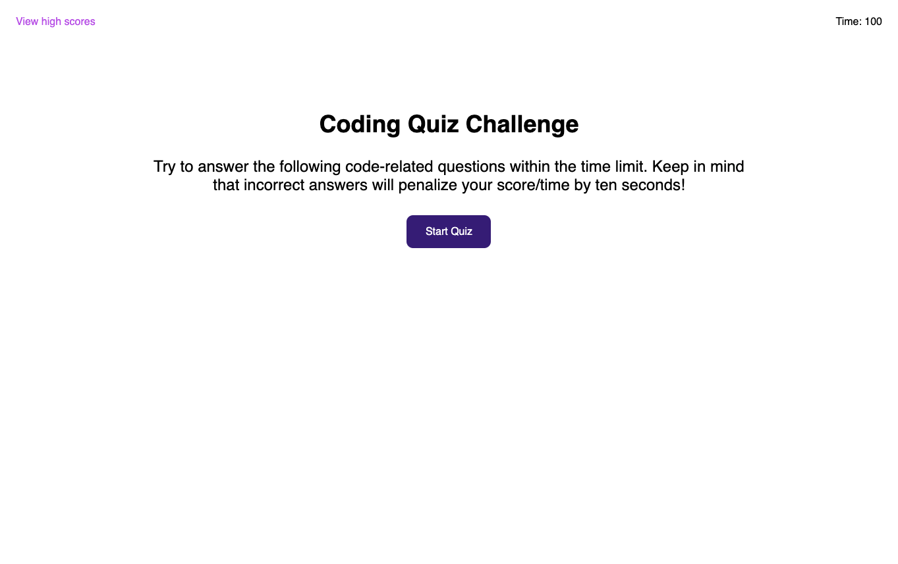

# JavaScript-Quiz

## Description

This application is a timed, javascript multiple choice quiz that returns users' scores with users' entered initials.

## Installation

Simply click the link to deploy the website to deploy the quiz.

## Usage

The purpose of this application is to display a timed multiple choice quiz in which the user clicks an answer to be selected, the next question appears and the user is notified if their selection was correct or incorrect. When a user gets a question incorrect, the timer will subtract 10 seconds from the time. The time will be used as the users score. If the time runs out or the users score hits 0 before all the questions in the quiz are displayed, the quiz will end. Users will input their initials at the end of the quiz and the user's initials with their corresponding time/ score will be displayed in order from highest score to lowest on a leaderboard.

## Built with:

- HTML
- CSS
- JavaScript

## This application can be found:

- https://michellewehr.github.io/javascript-quiz/

## Contribution

Anyone is welcome to contribute to this project. To do so, clone the local repository to your local workspace.

## Sources

UCONN's School of Engineering Coding bootcamp provided the mock-up in which the author based the project off of.

## Author

Michelle Wehr Napolitano
